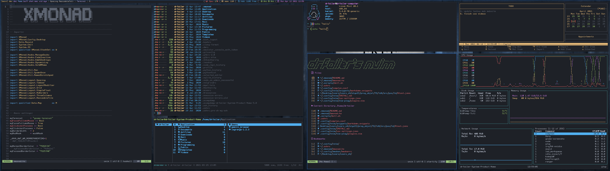
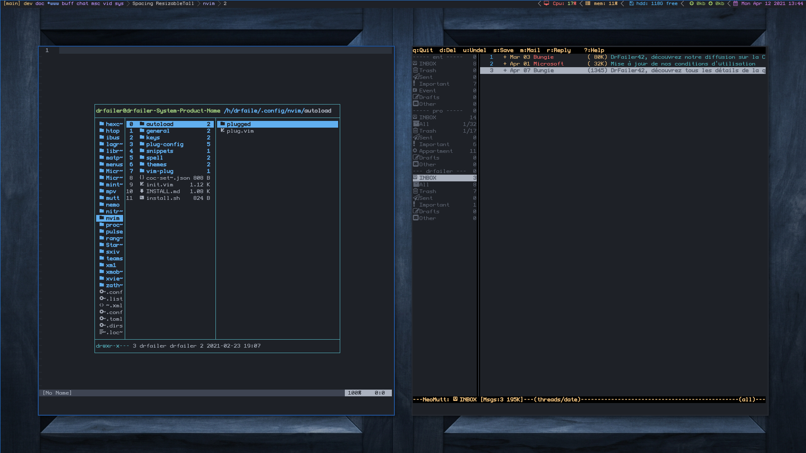

# XMonad config

## My applications

- xmonad
- xmonad-contribs
- xmobar
- dmenu
- j4-dmenu-desktop
- ranger
- neomutt
- calcurse
- ytop
- sxiv
- zathura
- conky

## keybings

| Keybindings          | Effect                                                |
|----------------------|-------------------------------------------------------|
| mod + shift + RET    | Launch a terminal                                     |
| mod + shift + p      | Launch j4-dmenu-run                                   |
| mod + p              | Launch dmenu                                          |
| mod + d              | Launch ranger                                         |
| mod + shift + m      | Launch neomutt                                        |
| mod + shift + y      | Launch ytop                                           |
| mod + c              | Launch calcurse                                       |
|----------------------|-------------------------------------------------------|
| mod + shift + c      | Close focused window                                  |
| mod + space          | Rotate through the available layout algorithms        |
| mod + shift + space  | Reset the layouts on the current workspace to default |
| mod + t              | Push window back into tiling                          |
|----------------------|-------------------------------------------------------|
| mod + TAB            | Move focus to the next window                         |
| mod + j              | Move focus to the next window                         |
| mod + k              | Move focus to the previous window                     |
| mod + m              | Move focus to the master window                       |
| mod + RET            | Swap the focused window and the master window         |
| mod + shift + j      | Swap the focused window with the next window          |
| mod + shift + k      | Swap the focused window with the previous window      |
|----------------------|-------------------------------------------------------|
| mod + h              | Shrink the master area                                |
| mod + l              | Expand the master area                                |
| mod + shift + l      | Mirror shrink                                         |
| mod + shift + h      | Mirror Expand                                         |
| mod + u              | decrease window spacing                               |
| mod + i              | increase window spacing                               |
| mod + shift + u      | decrease screen spacing                               |
| mod + shift + i      | increase screen spacing                               |
| mod + ,              | Increment the number of windows in the master area    |
| mod + .              | Deincrement the number of windows in the master area  |
|----------------------|-------------------------------------------------------|
| mod + shift + q      | Quit xmonad                                           |
| mod + q              | Restart xmonad                                        |
| mod + [F1..F9]       | Switch to workspace N                                 |
| mod + shift-[F1..F9] | Move client to workspace N                            |
| mod + {z,e,r}        | Switch to physical/Xinerama screens 1, 2, or 3        |

## Images

